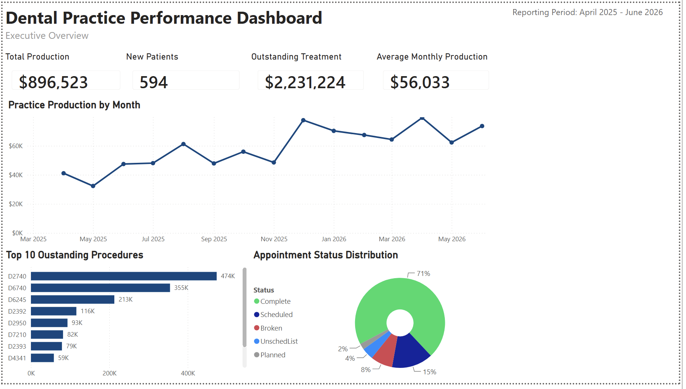
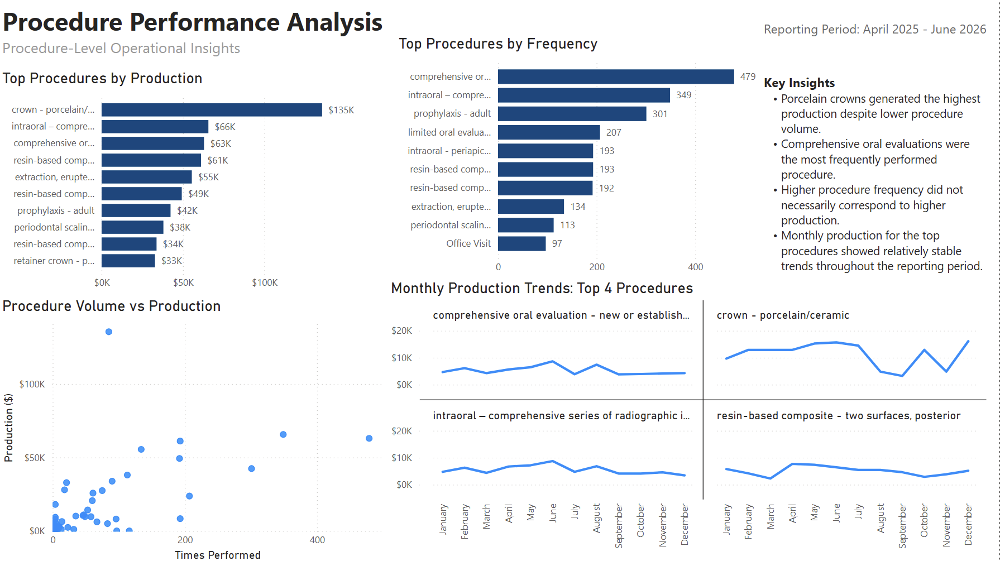

# Dental Practice Performance Dashboard

An interactive Power BI dashboard developed using de-identified operational data from a general dental practice. The project uses custom SQL queries to extract data from Open Dental and Power BI to transform, analyze, and visualize key practice performance metrics.

The dashboard was designed to help practice leadership monitor production, patient growth, appointment outcomes, outstanding treatment, and procedure-level performance.

---

## Dashboard Preview

### Executive Dashboard



### Procedure Performance Analysis



---

## Project Overview

Dental practices generate large amounts of operational data through scheduling, treatment planning, procedure completion, and patient management systems. However, these data are not always presented in a format that makes trends and performance issues easy to identify.

This project was created to transform raw Open Dental data into an executive reporting solution that supports operational decision-making.

The dashboard provides a high-level overview of practice performance and a more detailed analysis of procedure production, frequency, and monthly trends.

---

## Business Objective

The primary objective was to develop a Power BI reporting solution that could answer important operational questions for dental practice leadership.

The dashboard was designed to answer questions such as:

- How much total production was generated during the reporting period?
- What was the average monthly production?
- How many new patients were seen?
- How much treatment remains outstanding?
- How has production changed over time?
- Which procedures account for the greatest outstanding treatment value?
- What percentage of appointments were completed, scheduled, broken, planned, or placed on the unscheduled list?
- Which procedures generate the most production?
- Which procedures are performed most frequently?
- Does higher procedure frequency correspond to higher production?
- How do the highest-producing procedures change from month to month?

---

## Data Source

The dashboard was developed using de-identified operational data extracted from Open Dental through custom SQL queries.

The source data included:

- Monthly production
- New patient counts
- Appointment status
- Outstanding treatment
- Procedure frequency
- Production by procedure
- Monthly production by procedure

The original data originated from a private dental practice. Raw source files are not included in this repository because they contain confidential business information.

No patient names, dates of birth, addresses, contact information, chart numbers, insurance identifiers, or other protected health information are included in this repository.

The SQL scripts included in the `/sql` folder are sanitized portfolio versions. Practice-specific details and confidential fields have been removed.

---

## Dashboard Pages

### 1. Executive Dashboard

The Executive Dashboard provides a concise overview of overall practice performance.

#### Key Performance Indicators

- Total Production
- New Patients
- Outstanding Treatment
- Average Monthly Production

#### Visualizations

- Monthly production trend
- Top outstanding procedures by treatment value
- Appointment status distribution
- Reporting period summary

This page is intended to give practice leadership a quick view of financial performance, patient activity, treatment opportunities, and scheduling outcomes.

---

### 2. Procedure Performance Analysis

The Procedure Performance Analysis page provides a deeper view of procedure-level activity.

#### Visualizations

- Top procedures by production
- Top procedures by frequency
- Procedure frequency versus production scatter plot
- Monthly production trends for the top four procedures
- Key operational insights

This page helps identify which procedures generate the most production, which procedures are performed most often, and whether high procedure volume consistently corresponds to high production.

---

## Key Insights

The analysis identified several notable operational findings:

- Porcelain crowns generated the highest total production despite being performed less frequently than several lower-production procedures.
- Comprehensive oral evaluations were among the most frequently performed procedures.
- Higher procedure frequency did not necessarily correspond to higher production.
- Some lower-frequency procedures generated substantially more production per procedure than high-volume preventive or diagnostic services.
- Monthly production for the top procedures showed relatively stable trends across the reporting period, with some month-to-month variation.
- Outstanding treatment represented a significant potential production opportunity for patient follow-up and treatment scheduling.
- Completed appointments represented the largest share of appointment outcomes, while broken appointments and unscheduled treatment indicated opportunities for schedule and case-acceptance improvement.

---

## Technical Workflow

### 1. SQL Data Extraction

Custom SQL queries were written to retrieve operational metrics from Open Dental.

Queries were created for:

- Appointment status
- Monthly production
- New patient counts
- Outstanding treatment
- Procedure frequency
- Production by month and procedure

The queries were rewritten as sanitized `.sql` files for portfolio use.

### 2. Data Import

The SQL query results were exported as CSV files and imported into Power BI Desktop.

### 3. Data Cleaning and Transformation

Power Query was used to:

- Review and correct data types
- Format date fields
- Format production values as currency
- Rename fields for readability
- Remove unnecessary records
- Prepare datasets for visualization

### 4. Data Analysis

Power BI measures and visual-level aggregations were used to calculate and display:

- Total production
- Average monthly production
- New patient totals
- Outstanding treatment totals
- Procedure counts
- Appointment status percentages
- Top procedure rankings

### 5. Dashboard Development

The report was organized into two pages:

- Executive Dashboard
- Procedure Performance Analysis

Visuals were selected based on the business question being answered.

---

## Tools and Technologies

- Microsoft Power BI Desktop
- Power Query
- DAX
- SQL
- Open Dental
- CSV
- GitHub
- Healthcare operations analytics
- Business intelligence reporting

---

## Visualizations Used

- KPI cards
- Line chart
- Horizontal bar charts
- Donut chart
- Scatter plot
- Small multiples
- Top N filters
- Dynamic aggregation
- Data labels
- Tooltips

---

## Skills Demonstrated

- SQL data extraction
- Healthcare data analytics
- Power BI dashboard development
- Power Query transformations
- DAX measure creation
- Data cleaning
- KPI development
- Time-series analysis
- Procedure-level analysis
- Appointment outcome analysis
- Top N ranking
- Scatter plot analysis
- Small-multiple visualization
- Executive reporting
- Dashboard layout and design
- Business intelligence
- Data storytelling
- Operational performance analysis
- Healthcare data privacy awareness
- Technical documentation
- GitHub project organization

---

## Repository Structure

```text
dental-practice-performance-dashboard/
│
├── README.md
├── LICENSE
├── .gitignore
│
├── images/
│   ├── executive_dashboard.png
│   └── procedure_performance_analysis.png
│
├── sql/
│   ├── appointment_status.sql
│   ├── monthly_production.sql
│   ├── new_patients.sql
│   ├── outstanding_treatment.sql
│   ├── procedure_frequency.sql
│   └── production_by_month_and_procedure.sql
│
└── docs/
    └── data_dictionary.md
